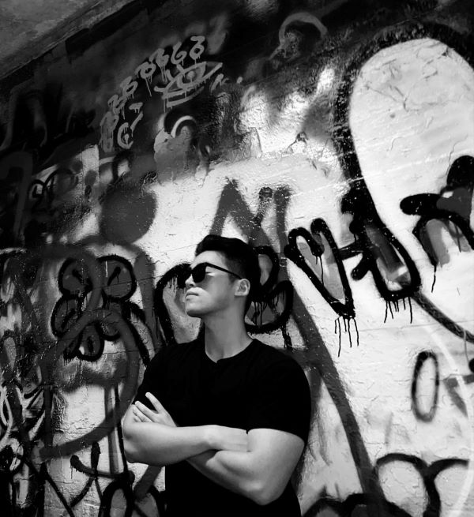
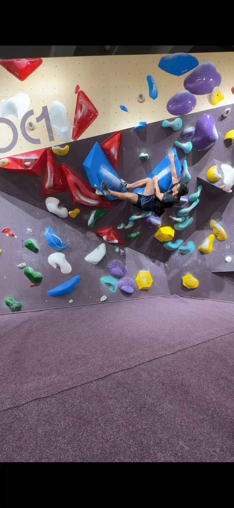
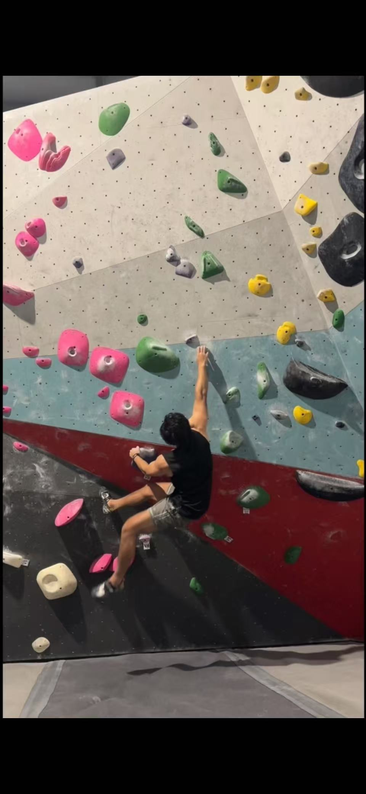
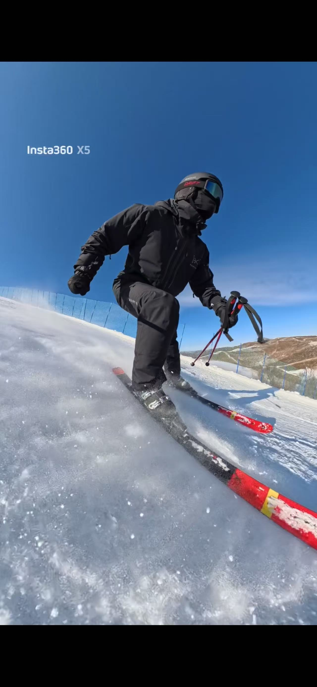

{: .profile-image}

Welcome to my personal website! I am Michael Qian, a Computer Science Ph.D. student at the University of Southern California. My research sits at the intersection of **robotics**, **human-computer interaction (HCI)**, and **immersive systems (VR/AR)**, with a focus on how humans and machines can **create, understand, and experience touch**. I study how **tactile and physical interactions**—captured through **force**, **vibration**, **motion**, **sound**, and **vision**—can be structured into representations that are meaningful both to **robots** and to **people**. Here, you will find an overview of my academic projects and research direction. Feel free to explore!

Here's a brief overview of my academic journey:
- Undergraduate studies: I completed my B.S. in Computer Science at the Georgia Institute of Technology 
- Graduate studies: 
    I completed my Predoctoral M.S. in Computer Science at the University of Chicago with Prof. Ken Nakagaki
    Currently pursuing my Ph.D. in Computer Science at the University of Southern California with Prof. [Heather Culbertson](https://viterbi.usc.edu/directory/faculty/Culbertson/Heather), focused on virtual haptic interactions and haptic rendering.
- Research Interests: Haptics, Robotics, HCI, VR/AR, Virtual Haptic Interactions, Haptic Rendering, Multi-Modal Interactions

On the **robotics** side, I explore **active and embodied perception**, where robots choose how to interact with objects (e.g., tapping, sliding, shaking) to efficiently infer **material properties**, **internal structure**, and **affective qualities** such as roughness or hardness. On the **HCI** side, I investigate how these representations can be exposed to users through **intuitive interfaces**, enabling people to **reason about**, **author**, and **manipulate** physical sensations rather than raw sensor data.

A core direction of my work is the integration of **VR/AR** and **language-based interaction** for **haptic and texture authoring**. I am interested in systems where users can describe objects and surface properties in **natural language**, generate or edit **3D objects and textures** in immersive environments, and **feel** the resulting surfaces through **haptic rendering devices**. This bridges **generative models**, **perceptual grounding**, and **interactive design**, allowing **tactile experiences** to be authored, modified, and shared as **first-class digital content**.

My long-term goal is to build **human-centered haptic systems** that connect **robotic perception** with **immersive interaction**—supporting applications in **teleoperation**, **design**, **accessibility**, and **embodied AI**, where **touch** becomes an **expressive and programmable medium**.

Outside of research, I chase problems that pull me upward—climbing and weightlifting are my favorite ways to reset my mind, test patience and focus, and build a sense of steady progress. I also escape to the mountains for skiing whenever I can.

{: .interest-image}
*Climbing session — training grip and movement control.*
{: .interest-image}
*Crimp work on the board — small holds, big focus.*
{: .interest-image}
*Ski days when I can trade a lab coat for fresh snow.*
{: .interest-image}
*Hiking breaks — open trails, big skies.*

Feel free to connect with me via [email](mailto:wanliqian965@gmail.com) or on [GitHub](https://github.com/Silverwings-zero).

<!-- [About Me](/aboutMe) | [CV](/Michael.pdf) | [Projects](/Projects) | [Blog](/Blog) -->

